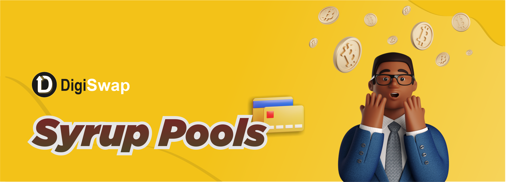

# 🍯 DGSweet Pools

### **What are DGSweet Pools?**

DGSweet Pools are the simplest way to earn free tokens on Digiswap.\
Stake DIGIS, earn free tokens. It’s really that easy.

Some special pools let you stake other tokens besides DIGIS, too!

### **How can I use DGSweet Pools?**


[sweet-pool-guide.md](sweet-pool-guide.md)



[auto-compounding.md](auto-compounding.md)


### Sweet Pool FAQs & Troubleshooting


[sweet-pool-faq.md](sweet-pool-faq.md)


### **How can I run a Sweet Pool for my project?**

Reach out via [the application form](https://docs.digiswap.finance/contact-us/business-partnerships).

### Sweet Pool Smart Contracts 

[All Manual DGSweet Pools](../../code/smart-contracts/main-staking-masterchef-contract.md)

[Auto DIGIS Sweet Pool](../../code/smart-contracts/cakevault.md)

### &#x20;

